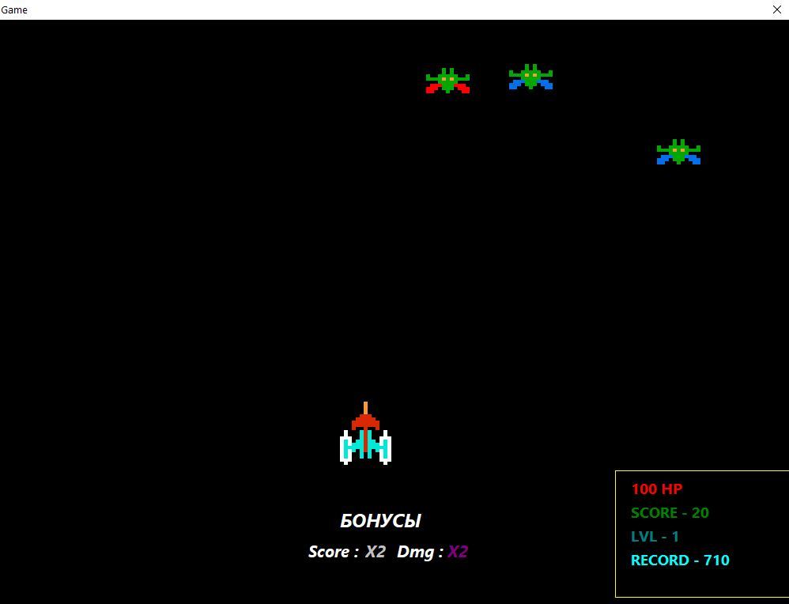

# Spacewar

Аркадный космический шутер, в котором поражение — ещё не конец. Уничтожайте волны противников, собирайте усиления и ставьте рекорды. Если корабль собьют, восстановите его в короткой мини-игре с проводами и возвращайтесь в бой.

> Проект находится на стадии игрового прототипа. Основной цикл уже реализован, но готовая Windows-сборка пока требует локальной настройки пути к базе рекордов.

## Игровой цикл

1. Маневрируйте в нижней части экрана и расстреливайте вражеские корабли.
2. Зачищайте волны: каждые 100 очков уровень растёт, а противников становится больше.
3. Ловите падающие бонусы, чтобы восстановить прочность или усилить корабль.
4. После уничтожения корабля соедините три пары клемм одинакового цвета.
5. Нажмите «Возродиться» и начните новый заход. Лучший результат сохранится локально.

## Что уже есть в игре

- бесконечные волны с нарастающей сложностью;
- два типа вражеских кораблей;
- стрельба противников и система прочности игрока;
- три вида бонусов;
- локальный рекорд в SQLite;
- мини-игра ремонта перед возрождением.

### Бонусы

| Бонус | Эффект |
| --- | --- |
| Аптечка | Восстанавливает 20 HP |
| DMG ×2 | Удваивает урон до конца текущего уровня |
| Score ×2 | Удваивает очки за уничтожение врага до конца текущего уровня |

Бонусы начинают появляться после первого уровня. На высоких уровнях они выпадают чаще.

## Управление

| Действие | Управление |
| --- | --- |
| Движение влево | `A` |
| Движение вправо | `D` |
| Выстрел | щелчок мышью в окне игры |
| Ремонт корабля | по очереди нажмите на клеммы одинакового цвета |

## Запуск

Игра рассчитана на Windows x64. Исполняемый файл, ресурсы, база данных и `sqlite3.dll` должны находиться внутри каталога `game` с сохранением текущей структуры.

Сейчас путь к `game_db.db` задан непосредственно в исходном коде. Поэтому перед запуском на другом компьютере необходимо:

1. Установить [Lazarus IDE](https://www.lazarus-ide.org/) с Free Pascal Compiler. Проект создавался с LCL 2.2.6.
2. Открыть `game/project1.lpi`.
3. В `game/unit1.pas` найти присваивание `SQLConnector.DatabaseName` и указать абсолютный путь к локальному файлу `game/game_db.db`.
4. Собрать проект командой **Run → Build** или через консоль:

   ```bash
   cd game
   lazbuild project1.lpi
   ```

5. Запустить `game/project1.exe` из каталога `game`, чтобы игра смогла найти папку `assets` и `sqlite3.dll`.

## Технологии

- Object Pascal / Free Pascal;
- Lazarus и LCL для оконного интерфейса и игрового цикла;
- SQLite для хранения лучшего результата;
- BMP-ресурсы для кораблей, снарядов и бонусов.

## Структура проекта

```text
game/
├── assets/          # графика игрока, врагов, снарядов и бонусов
├── unit1.pas        # основной игровой цикл и механики боя
├── unit2.pas        # мини-игра ремонта корабля
├── project1.lpi     # проект Lazarus
├── project1.exe     # готовая Windows x64 сборка
├── game_db.db       # локальная база рекордов
└── sqlite3.dll      # SQLite для Windows-сборки
```

## Текущий статус

Это учебный прототип, а не завершённый коммерческий релиз. Перед полноценной публикацией проекту нужны переносимый путь к базе данных, упаковка Windows-сборки, экран старта и дополнительное тестирование игрового баланса.
